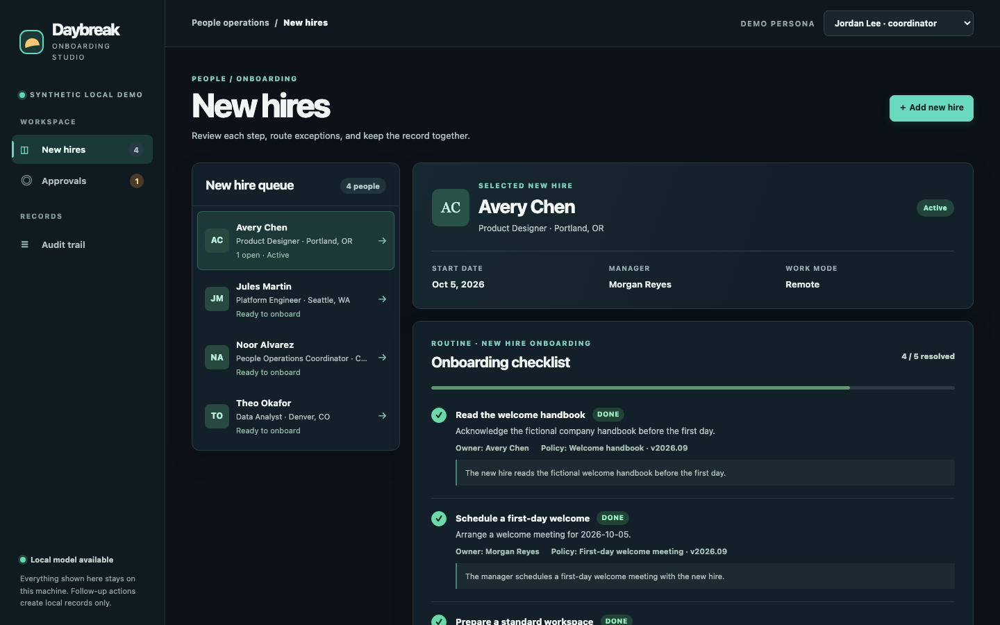

# Daybreak

A runnable local HR onboarding demo for the fictional **Northstar Studio**. Start a policy-backed checklist, ask a real local model to route an exception, review it as an admin, and retain the decision and local follow-up in SQLite.

## Demo

[Watch the 50-second walkthrough](docs/demo/daybreak-dark-walkthrough.mp4) · [Full desktop view](docs/demo/daybreak-dark-desktop.png) · [Mobile view](docs/demo/daybreak-dark-mobile.png)



## Run

Prerequisites: **Node 24.2+** and **Ollama** installed and running. On this Mac, Node 26.7 and Ollama are already available. If Ollama is stopped, open its app or run `OLLAMA_NO_CLOUD=1 ollama serve` in a separate terminal. This environment variable must be set on the Ollama daemon, not just on Daybreak.

From the repository:

```sh
npm run setup
npm start
```

Open **http://127.0.0.1:4317**. There are no npm runtime dependencies or paid API keys. Setup checks the local runtime and downloads `qwen2.5:3b` through Ollama only if it is missing (about 1.9 GB). Model download requires internet; normal use with installed weights uses only loopback requests. Model weights stay in Ollama's storage, outside this repository.

## Try the complete flow

1. Select **Avery Chen** and click **Start onboarding**. Each task includes its owner and fictional handbook policy. Mark ordinary tasks done.
2. Click **Run local judgment**. Wait for the actual Ollama result, suggested route, uncalibrated confidence, and uncertainty flag. A failed run stays visibly failed and can be retried; it never becomes a pretend result.
3. Switch the **Demo persona** to **Maya Chen · admin** and open **Approvals**. Enter a reason, then **Approve & create local task**. One internal follow-up record is created atomically with the decision.
4. Run **Jules Martin** through onboarding and judgment, then reject that request. Rejection creates no follow-up action.
5. Open **Audit trail** for the decision maker, reason, action, and timestamps. Stop the app with Ctrl-C and start it again: workflows and history remain. Browser demo sessions reset to coordinator.

**Noor Alvarez** exercises a checklist without an exception. **Theo Okafor** supplies an ordinary IT routing case. You can also add a fictional hire. Use synthetic information only.

## What is real, and what is simulated

- **Real:** local model inference, SQLite storage, durable jobs, server-side role checks, approval/rejection, internal follow-up creation, and append-only application audit/event records.
- **Simulated:** the company, handbook, employees, and persona identities. The persona switch is intentionally available to anyone using this local demo; it is **not production authentication**. Completing a checklist records an acknowledgment; it does not provision a laptop or account.
- A follow-up is only a database task record. There is no email delivery, HRIS write, account access grant, spending, payroll, benefits eligibility, hiring, or termination action.
- The model only proposes a route. Code creates tasks, validates dates and inputs, enforces permissions and review, and executes the approved local action. **Every exception requires admin review**, including confident model results. Confidence is not calibrated; routing may still be wrong.

**Observed model limitation:** during validation, the original 1.5B model wrongly treated a mixed laptop/stipend question as a security request with 90% confidence. The final 3B model handled that case better, but still routed the ordinary VPN/authenticator fixture to Security with 100% confidence. These are real model errors, not policy decisions. The admin gate prevents an automatic external action; the small model is not ready for autonomous HR routing.

## Local data and inference

The server binds to `127.0.0.1`. The UI loads no external assets. Requests have same-origin/Host checks and a per-session CSRF token. The provider accepts only loopback HTTP origins, refuses redirects and cloud-tagged models, and verifies local weight metadata before sending a case. For defense in depth, run Ollama with `OLLAMA_NO_CLOUD=1`. The local daemon and machine owner remain trusted.

Only role, location, work mode, exception text, and relevant fictional policies are sent to local inference; names and start dates are omitted from the structured input. There is no cloud fallback. A custom provider should preserve this explicit boundary.

Data lives in `.data/daybreak.sqlite` with SQLite WAL files. Use one app process per database. Stop the app before copying the entire `.data` directory for a backup. Audit and event tables reject updates/deletes through database triggers; they are not cryptographically tamper-proof against the machine owner.

To start an independent fresh demo while retaining existing data:

```sh
DAYBREAK_DB=.data/fresh-demo.sqlite PORT=4318 npm start
```

Optional environment variables (see `.env.example`; export them in your shell):

| Variable | Default | Purpose |
| --- | --- | --- |
| `PORT` | `4317` | Local web port |
| `DAYBREAK_DB` | `.data/daybreak.sqlite` | SQLite database path |
| `OLLAMA_BASE_URL` | `http://127.0.0.1:11434` | Loopback Ollama origin |
| `OLLAMA_MODEL` | `qwen2.5:3b` | Installed local model; cloud models refused |

If inference is unavailable, the rest of the checklist remains usable. Start Ollama, run setup, then retry the failed judgment. Jobs interrupted by a crash are requeued on restart; graceful shutdown waits for in-flight inference. Completed judgments and approval decisions are not rerun.

## Validation

```sh
npm test             # Deterministic workflow and provider boundary tests
npm run model:smoke   # One actual local model invocation
npm run test:live     # Actual server processes, real inference, approval/rejection and restart
```

Unit/integration tests explicitly use provider doubles and loopback mock servers. The live test uses real Ollama, temporary SQLite storage, and actual server process restart; it leaves the demo database unchanged. Run `VALIDATION_OUTPUT=docs/validation-live.json npm run test:live` to save evidence. See [validation evidence](docs/VALIDATION.md).

## Code map

| Path | Responsibility |
| --- | --- |
| `src/server.mjs` | HTTP, sessions, request boundaries, local asset serving |
| `src/store.mjs` | Schema, persistence, events, audit constraints |
| `src/workflow.mjs` | Deterministic routine, job worker, approval transaction |
| `src/provider.mjs` | Narrow `health()` / `judge()` local inference adapter |
| `src/fixtures.mjs` | Synthetic company, policies, routines, and employees |
| `public/` | Accessible responsive web UI, no build step |

The [API contract](docs/API.md) and [fictional handbook](docs/HANDBOOK.md) describe the domain. A future TypeSafe Jev or customer-configured provider can implement the narrow inference interface; it must not take ownership of workflow state or action authorization.

Before a real pilot: add authenticated identities and access control, a reviewed policy and routing evaluation set, privacy/retention controls, migration/versioning strategy, and one explicitly authorized HRIS integration. This demo is intentionally a single-process local application.

MIT licensed. Independently designed; no Warp source, branding, or assets are included.
